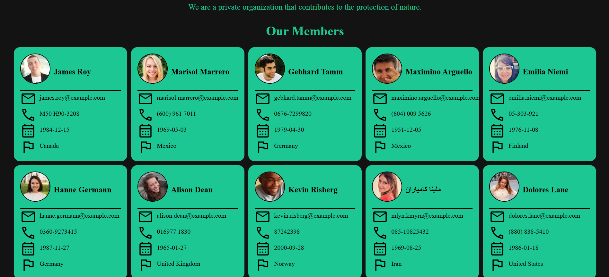

# 📇 Personal Profile Card

This project is a simple React application that fetches user data from an API and displays it in profile cards. Each card includes user details such as name, email address, birth date, phone number, and country. The app uses React components, object destructuring, and props.

---

## 🎯 Features

- Fetching user data from an API (Fetch API)
- Stylish profile card for each user
- Component-based structure using React
- Usage of props and object destructuring
- Clean and readable code

---

## 🛠️ Technologies Used

- HTML
- CSS
- Fetch API
- React (for component structure)

---

## 🖼️ Screenshot



---

## 🚀 Installation and Running the App

To run this project on your local machine, follow these steps:

```bash
# Clone the project
git clone https://github.com/your-username/personal-profile-card.git

# Navigate to the project directory
cd personal-profile-card

# Install the dependencies
npm install

# Start the application
npm start